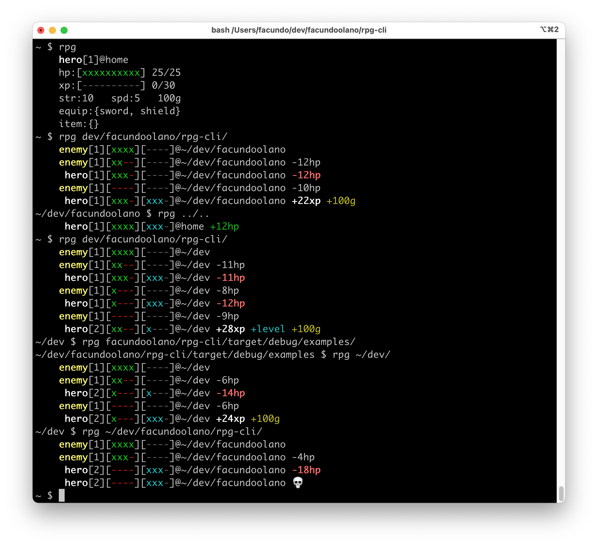

# rpg-cli —Your filesystem as a dungeon!

rpg-cli is a bare-bones [JRPG](https://en.wikipedia.org/wiki/JRPG)-inspired terminal game written in Rust. It can work as an alias to `cd` where you randomly encounter enemies as you change directories.

## Install from binary

TODO

## Install from source

To install from source (assuming Cargo is available):

    $ cargo build --release

Check the [rpg.sh](./rpg.sh) script for an example of how to use the game as an alias of `cd` (so the working directory is updated according to the hero's progress).

## Usage

TODO
